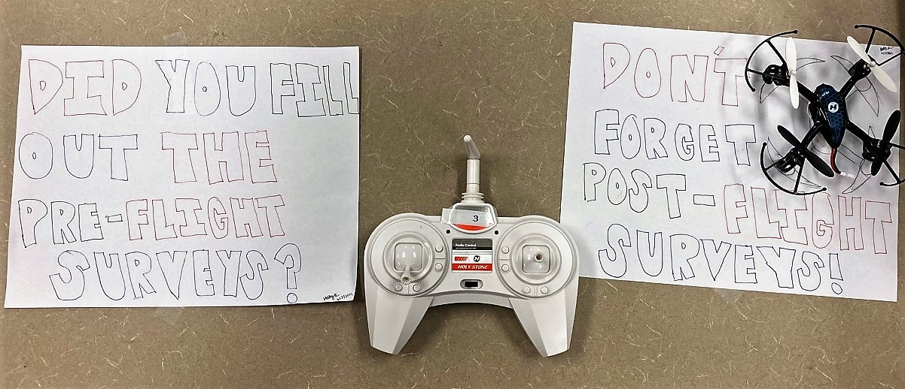
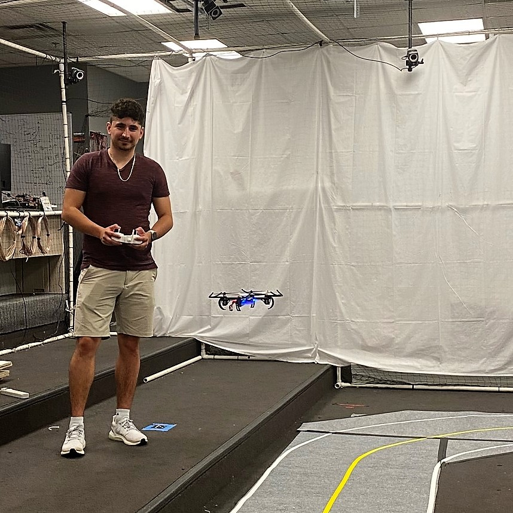
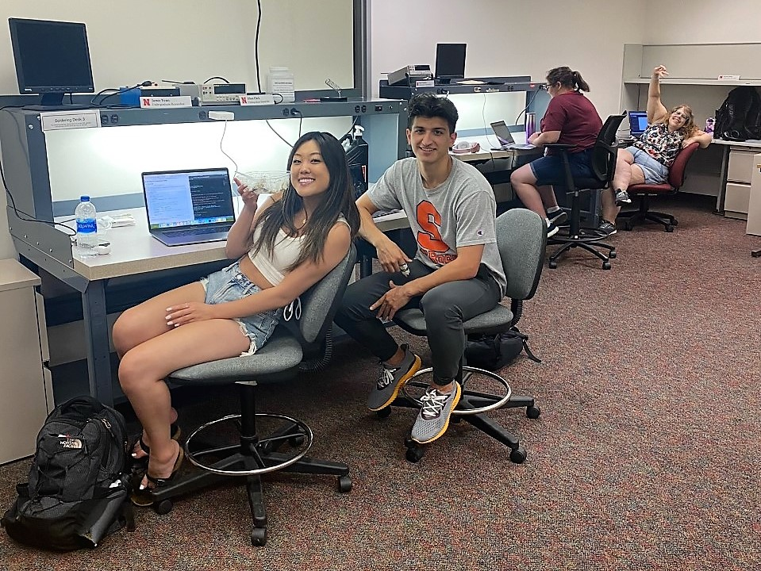
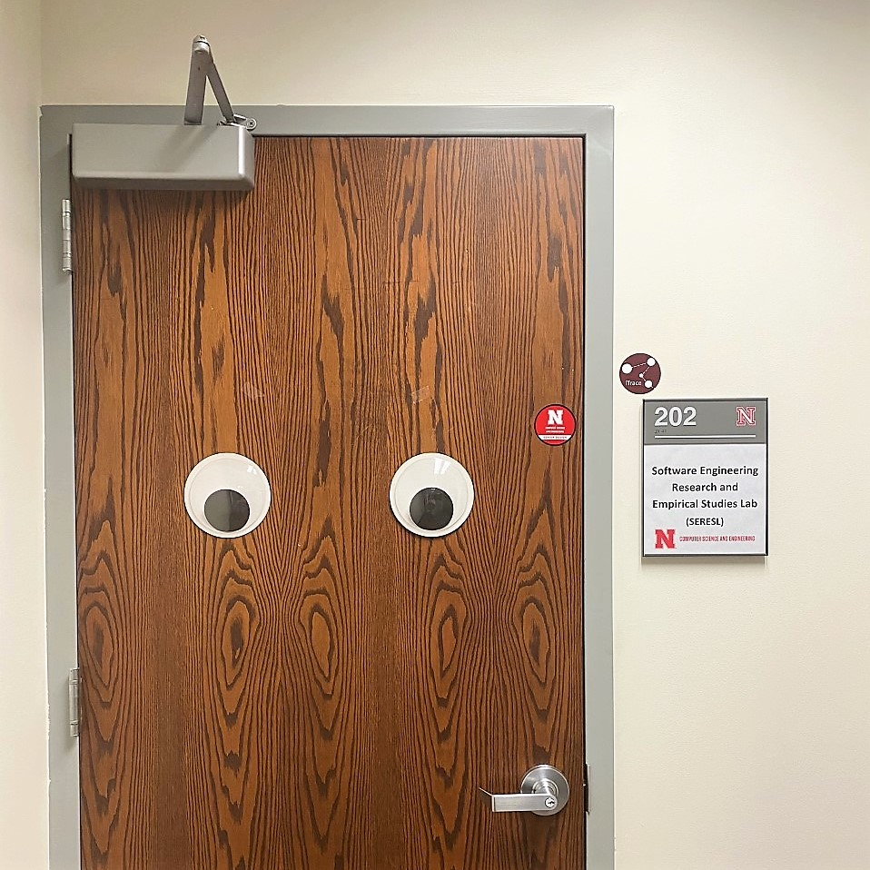
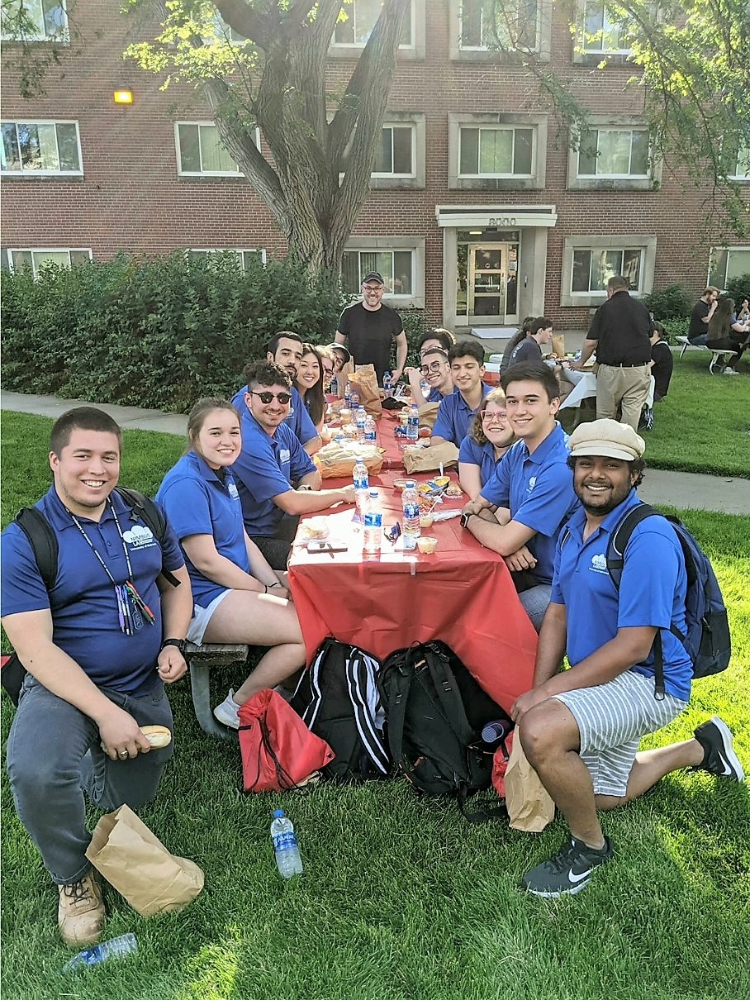

# Week 1
This week, we met our advisors and mentors and explored the lab together for the first time. We discovered that not only would we be flying drones for the summer, we could also make our own and even earn our drone pilot's license! 

## About Me
My name is Kristen, and I'm a math major going into my last year at University of Texas Rio Grande Valley. After I learned about the Summer Research Program at Nebraska, it's been my top goal to work in the NIMBUS lab this summer because I want to learn more about computer science research. I'm so excited to be here!

## Flight Training

I have never flown a drone before, so I had to learn about the basics before anything else. Paul, one of the mentors, helped me understand the four types of movements of the drone: thrust, yaw, pitch, and roll.  Before I describe what each of these mean, it's **very** important that each time we fly, we do pre and post flight surveys. Hadley created art to help us remember :) 

Thrust is up and down on the left stick, whereas yaw is left and right on the left stick. Thrust is how the drone raises and lowers in height. Yaw is how the drone is oriented with respect to its front side - the possible actions encompass a 360 degree rotation, looking at the drone top-down. On the right stick, roll is left and right and pitch is up and down. Roll is how the drone steers left and right, and its possible actions encompass a 360 degree rotation, looking at the drone from its' long side. Roll is how the drone steers up and down, and its possible actions encompass a 360 degree rotation, looking at the drone from its' short side. *I also learned how this is a lot harder to explain in writing while constructing this blog post.*

I wish I was as good as Santiago is at flying drones. He can land the Hubsan on a a platform even when it is oriented backwards (yaw is 180 degrees)! Anyway, *I* flew the Hubsan drone and it broke after about 5 minutes - oops :') - after one of the wire connections broke from the battery connector. It's a good thing I finished setting up the Robot Operating System (ROS) on my device, and completed my CITI trainings. 

## My Project

I found myself really interested in flying the drone right away because I wanted to know what a novice (me) is going through flying a drone. Because our project includes an eye-tracking component, we're considering the differences in eye movement between a novice and expert flyer. Check out how cool the eye-tracking lab looks!

I learned about how eye movements may differ with an actual pilot checking out their six-pack (yes, that's actually what their panel of aircraft instruments is called!) - the novice might look at all the panels in a clockwise motion, whereas the expert may dart between a path connecting the bottom left and top right instruments.  

Overall, it's been really nice working with everybody else in the lab! I appreciate how dedicated everyone is to keeping our community strong - for all our first week events, we pushed picnic tables together so we could all sit together. And everyone at the picnic on Wednesday was definitely jealous of our nifty NIMBUS polos :D I'm so grateful to be a part of this team and I'm excited for what's to come! [Want to read about next week?](./2/HallasWK2.md)

# Table of contents
[Week 1](./1/HallasWK1.md)
[Week 2](./2/HallasWK2.md)
[Week 3](./3/HallasWK3.md)
[Week 4](./4/HallasWK4.md)
[Week 5](./5/HallasWK5.md)
[Week 6](./6/HallasWK6.md)
[Week 7](./7/HallasWK7.md)
[Week 8](./8/HallasWK8.md)
[Week 9](./9/HallasWK9.md)