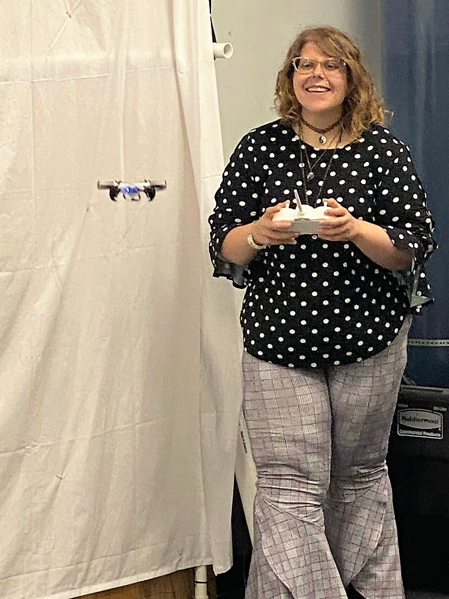
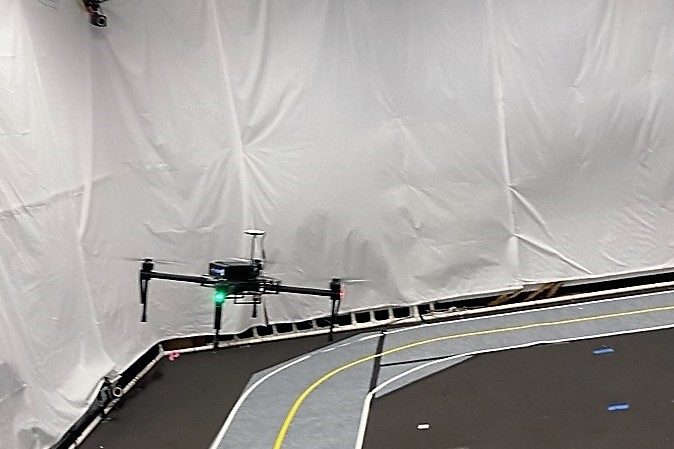
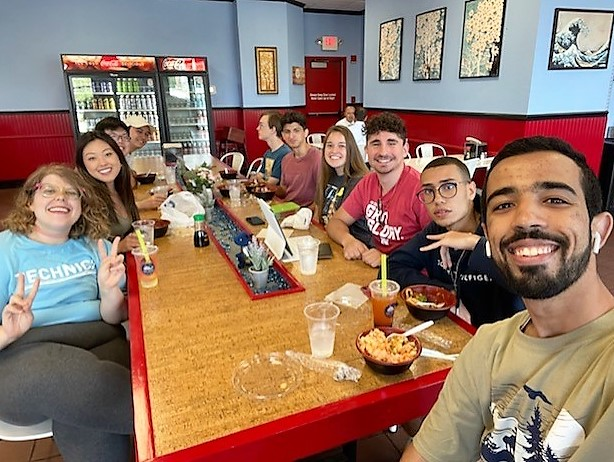

# Week 2
This week, we continued our flight trainings and started to focus on our literature review.

## Flight Training

This week *flew* right by! I started the week strong by focusing my efforts on flight training - and practice really does make perfect. Something I realized about myself is that when I'm not good at something right away, I don't like to make time doing it. But since the flight training is integral to our project, so I got out of my comfort zone to keep trying. 

I played music I liked, dedicated at least an hour to flying, and focused on keeping out of the netting as much as possible. Before I knew it, I could maintain hover at all distances! During this process, I also got more accustomed to mid-flight recalibration, softer landings, and navigation to various points around the origin. The flight training process got more rewarding as we began to see bigger drones take flight in the cage, like the DJI Matrice 100.

## My Project

I spent a majority of the week searching for papers that will clarify our direction for the research. I started using Mendeley to keep track of what I found, which was so much easier than keeping a bunch of tabs open on my computer. I found a lot of interesting work cited in the "From Novice to Expert" paper, that led me to reading about task difficulty in aviation, normalization methods for gaze-based interaction data, and bird flight patterns. There's still a lot of first passes I want to make before diving into the works I feel will be most relevant. 

The techniques covered this week for reading literature have been very helpful! For previous experiences, I have gotten lost in a paper for hours without really knowing what I'm looking for. This project has helped me look at literature reviews in a new light. By taking a broad view at all the related areas of a project, I can pull together the relevant pieces that make my contributions uniquely useful to the field. 

During the week, I also continued working on ROS tutorials, prepping for the Part 107 exam, and improving the skills needed for my project.  Our team spent time at Jazz in June, tried Grey Whale and Ivanna Cone, and learned a lot about self-efficacy from our professional development workshop this week. In the spirit of practicing self-efficacy, I strongly believe we will all make a valuable contribution in the NIMBUS lab this summer. See you next week! [Want to read about next week?](/3/HallasWK3.md)

# Table of contents
* [Week 1](/1/HallasWK1.md)
* [Week 2](/2/HallasWK2.md)
* [Week 3](/3/HallasWK3.md)
* [Week 4](/4/HallasWK4.md)
* [Week 5](/5/HallasWK5.md)
* [Week 6](/6/HallasWK6.md)
* [Week 7](/7/HallasWK7.md)
* [Week 8](/8/HallasWK8.md)
* [Week 9](/9/HallasWK9.md)