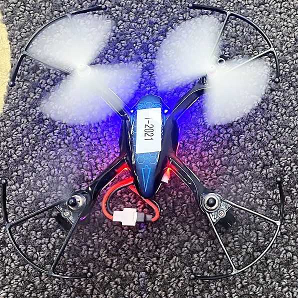
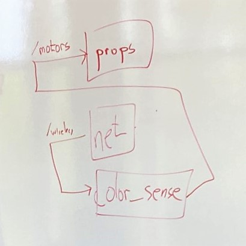
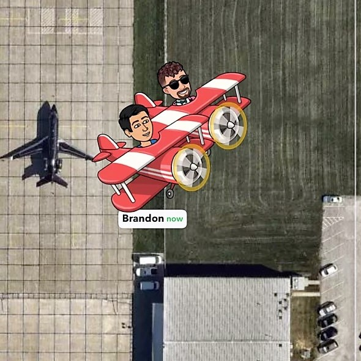
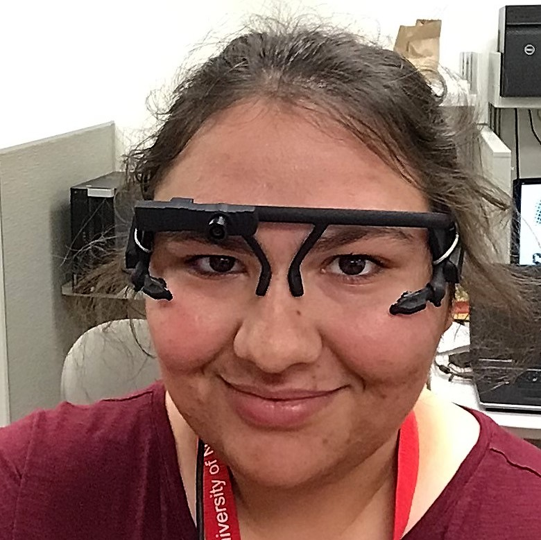
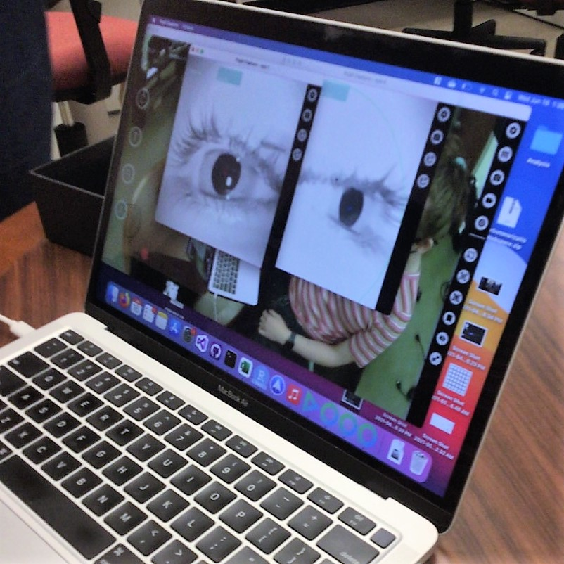
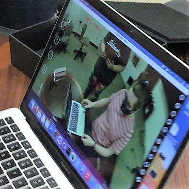
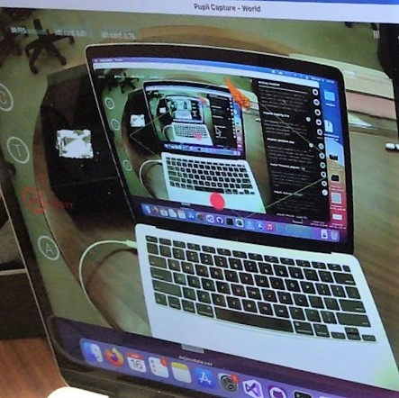
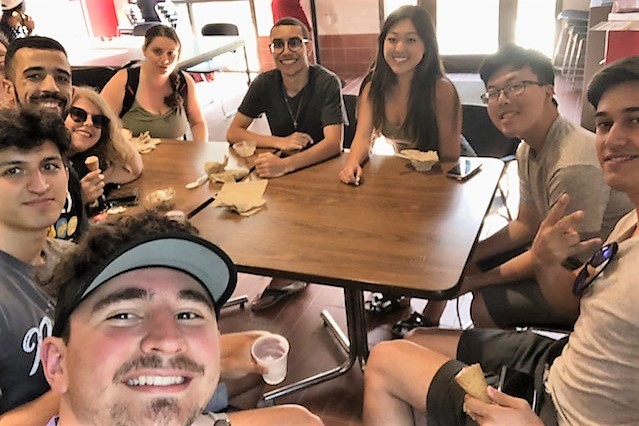
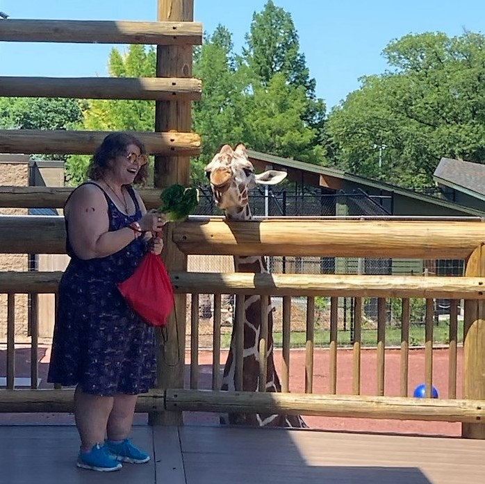
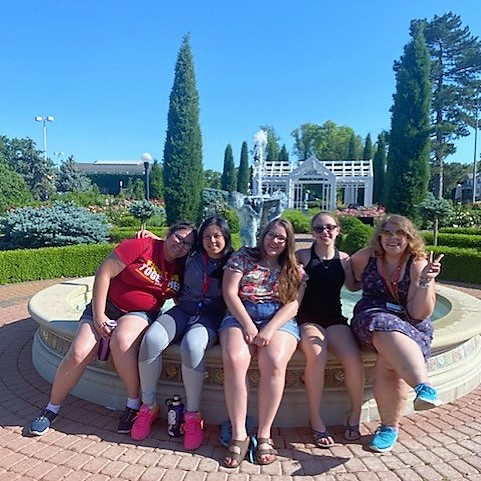

# Week 3
This week, we got even better at flying drones, operating ROS, and reading academic papers - and got to *eye* the gear in the eye-tracking lab for the first time! 

## Flight Training

The hovering skill in my repository from last week better equipped me to practice landing. On Tuesday afternoon, I made what I believed to be my first-ever, truly "soft" landing - no bounce! I avoided the netted ceiling all week and worked on my roll/pitch stability. I still notice some erratic movements and my propensity to lose control of the drone when pitch is oriented to approach me. 

I think this user experience is related to the controller. Since thrust is an up/down movement, and pitch control is an up/down movement, my brain gets confused about which side of the controller I should be operating. I'll find myself seeing the drone raise higher and higher in altitude, while I am trying to stop the drone from approaching me! I try my best to land as soon as possible when this happens, which causes the undesirable "hard" landing. 

Based on my experience learning how to fly from scratch (with moderate video game experience) I suggest that calibration be included as part of the initial training. Exposing the new flyer to this "stabilization" mechanic at the start will better align their flight expectations with their flight experience - especially as they perform their first few landings. 

I have also enjoyed learning about how the drone itself operates. On Wednesday, I noticed the white, right propeller of the Hubsan I was operating would stop spinning ahead of the other propellers. After sharing my user experience to another member of my cohort, they explained to me that the landing-leg had a stripped gear. Even though it could be pushed into place manually, with each "hard" landing, another manual replacement would be required. Flight training has made me more observant of and more curious about the mechanisms behind technology. This curiousity motivated me to ask another member of my cohort about ROS.

It turns out that some undergraduate members of our research group have had previous ROS experience - so on Monday, I asked one if we could have a session to talk about how they conceptualize ROS. This lesson helped me grasp the "anatomy" of ROS in relation to robotics, and its similarity to an object-oriented programming language. I learned how different **nodes** of the robot, such as its propellers or network, can both listen and publish to **topics**, such as wireless or motors, as needed - and I see how all of these **nodes** must be contained in a **package**. I haven't explored ROS first-hand as much as I'd like because of how finicky my computer can be, but watching tutorials has been useful - and the student-led demonstration, even more so. I hope it helped everyone else as much as it helped me!

Some other members of our group took their flight exam on Monday before joining this session - and it was so cool to see their Bitmojis on Snapchat as flying airplanes! This inspired me to get more serious about preparing for the FAA Part 107 exam, so I listened to parts of the study guide in the afternoon as I let my brain recover from all the literature I'm reading.

## My Project

Before diving into the literature deep dive I've been doing, I must express how much I like Mendeley as a citation manager! I had no idea these platforms existed to capture notes, highlights, and make the citation process much easier (I've done citations on LaTeX before, but I just typed them manually), so I appreciated this exposure. By the end of this week, I plan to have finished all my first passes for the 46 academic works I found, and have a narrow view of the pieces I will include in my literature review. 

Looking for relevant literature can be challenging to me at times. I find such interesting articles, like about companion UAVs and the whiteness of AI, that I really want to integrate into my work - but I know that these are likely not related enough to my current project. Though I have also found this is a way to find work that could be very relevant to my project! For example, on an article about Drone Racing (DOI: 10.1109/LRA.2021.3064282), I found several citations about the differences in driver behavior between novice and experienced drivers, including both simulated and field experiments in driving. However, this work is more about the process of flying itself, rather than flight paths, so it will likely be discluded. 

My Mendeley library currently contains aviation articles, drone articles, eye-tracking articles, and expertise articles - along with several articles that encapsulate more than one category. In my final review, I intend to include some articles from Dr. Duncan and Dr. Sharif, as well as from Dr. Admoni and Dr. Godwin. On Tuesday, Dr. Detweiler reminded us that a thorough review will prepare us in how we can ask more interesting research questions - so collecting eye-tracking articles related to novice/expert differences and checking out the eye-tracking lab all happened at the perfect time!

  

 

On Wednesday, Cole showed us the head gear and platform from Pupil Labs we will be using for our research. We talked about April tags to mark the cage platform to streamline environment construction, as well as the usefulness of having the camera set-up in the drone lab. Confirming the location of the drone from two sources, the pupil labs camera and the drone lab camera, will strengthen our data set for further annotation and analysis. We recorded a sample set of data and received it, so we could compare the data we receive with the data mentioned in academic works. With all of this information, I'm certain we will develop great research questions. 

It's been really fun to hang out with the group! We went to the Dairy Store on Wednesday and got some really good ice cream. I've been utilizing the gym area next to Suites to practice dancing, jump roping, and get my sweat on in the evenings. Over the weekend, I went to two farmer's markets, the Lincoln children's zoo, and the neighboring rose garden - all in one day! It was one of the busiest Saturdays that I think I ever had. So Sunday I did a lot of recovery yoga! For the next week, I know for sure I'll finalize my literature review. **Hopefully** I will also master my pitch and roll control on the Hubsan drones, find out next time!

 