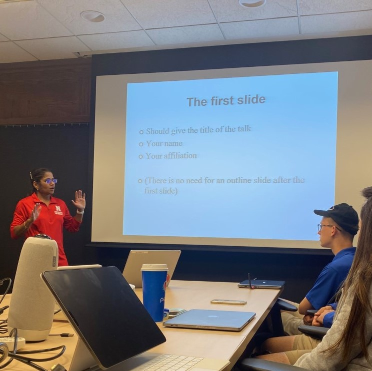
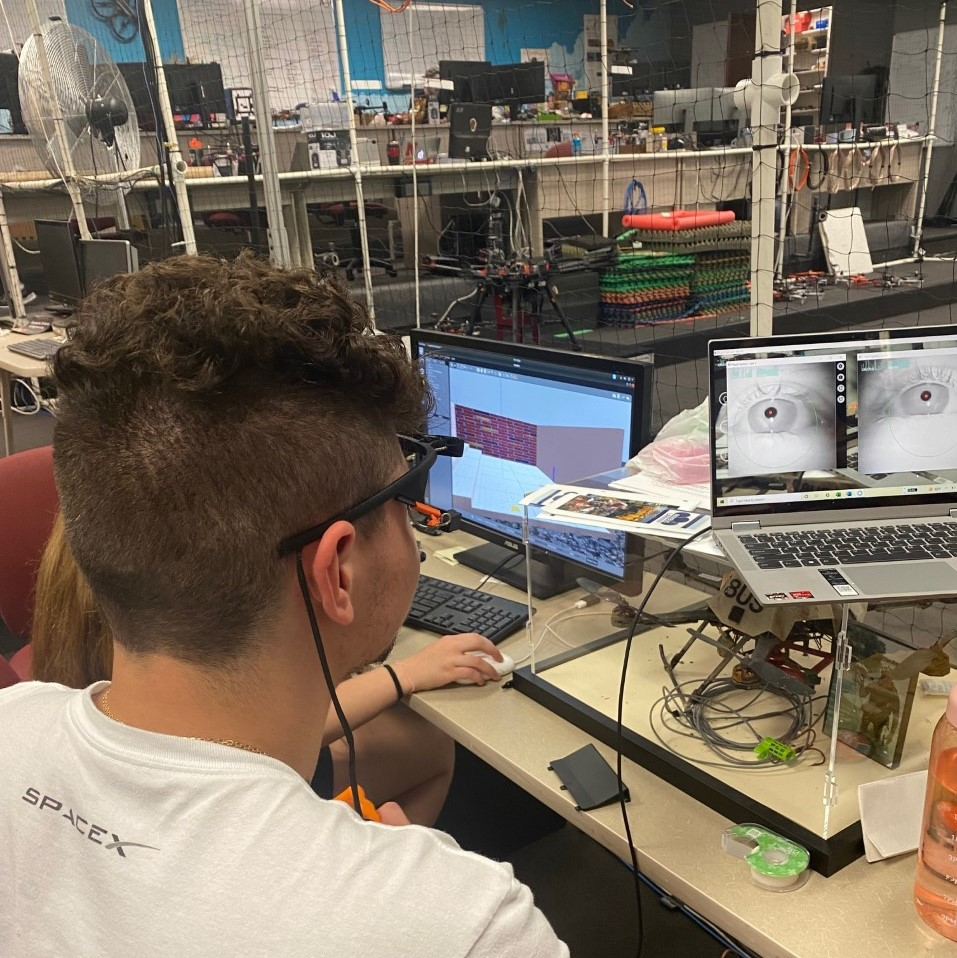

# Week 7
This week, we finalized a calibration technique, collected the pilot data for our study, and drafted our posters! 

## My Project
First, we heard some great thesis defenses from Ajay and from Daniel to inspire us for our own presentations. Then, Dr. Sharif spoke to us about presenting a paper. I thought her tips were really helpful! I can find extra time to explain more complicated parts about my work by omitting the redundant table of contents and "questions?" slide. I also appreciated her genius idea of creating "back-up" slides that the audience can unlock by asking the right question - really cool!
 

Anyway, in regards to our project, we concluded early in the week that natural features was more effective as a calibration method compared to single marker. Grace and I participated in 2 trials each, utilizing each calibration method. During each trial, we spent 30 seconds looking at nothing but the drone. So, we arrived at our conclusion by comparing the amount of fixations targeted on the drone for each method. For both mine and for Grace's trial, natural features had more fixations looking at the drone itself. We noticed less fixations and more saccades on the single marker trials. Natural features was a lot more consistent and reflected more accurately what the eyes were doing!
 

Our biggest concern regarding the natural features calibration was the length of time it would take. When we conducted our last trial, Siya observed how we completed the natural features method for her study. Later this week, she followed up with us and let us know we could try an alternative method for calibration. Instead of hanging up markers everywhere, we could hold up a step-ladder with a single marker on it, and move it across the room. So, no more big ladder, pinning up markers on the top of the cage and taking them down between trials (woohoo!!) - our team was very happy with this discovery.

 

By the way, I got to participate in Siya's study this week! I thought it was really cool how our study contributed to how she developed the calibration method for her study. I hope the data she recorded from my flight is interesting. I ended up crashing the flame wheel and breaking a propeller. She fixed it so quickly it was like NASCAR. 

 


Towards the end of the week we finally collected data for our novice and our experienced pilot!! The trials took about 30-45 minutes per person. 

 

I'm excited to see what our findings are, stay tuned!

## Lincoln

It was another great week to explore Lincoln! My friends and I went to Grey Whale for more happy hour and I got the best sushirito ever :D

 

One of the most Nebraskan things I think that I did was try a burger with peanut butter on it - actually it was pretty good! Apparently you can make bubble tea with cotton candy on it, but I'm not a big fan - I prefer the Bee's in a Pod tea in McAllen. 

 

On the other hand, the HuHot Mongolian Grill is way better than the restaurant in my town! Soooo good :) and I finally got a chance to see the beautiful Rabbit Hole Bakery! They had avocado brownies and I got a bunch for my friends. 10/10 recommend!

 

Next week, we will finish analyzing our data and creating our posters. See you then! 