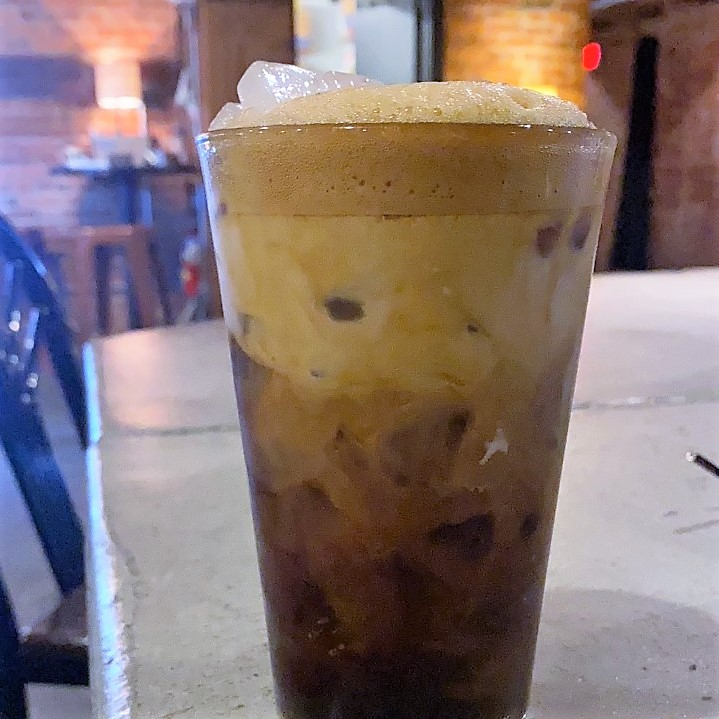
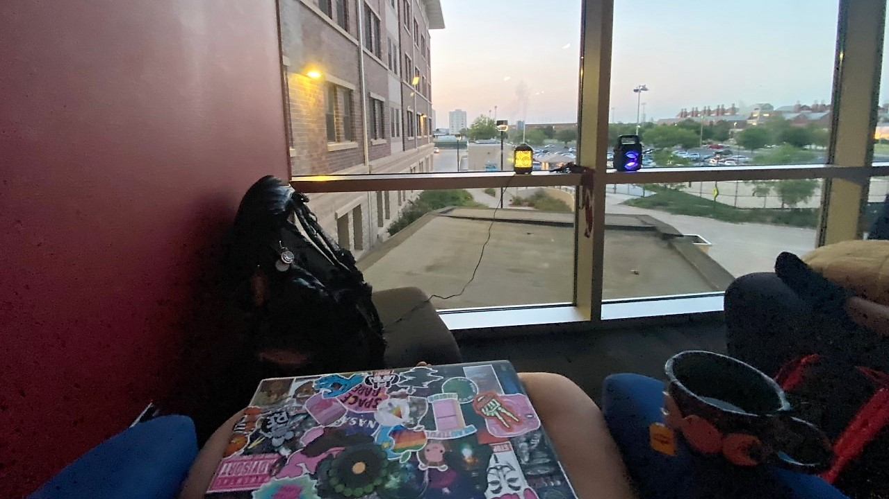
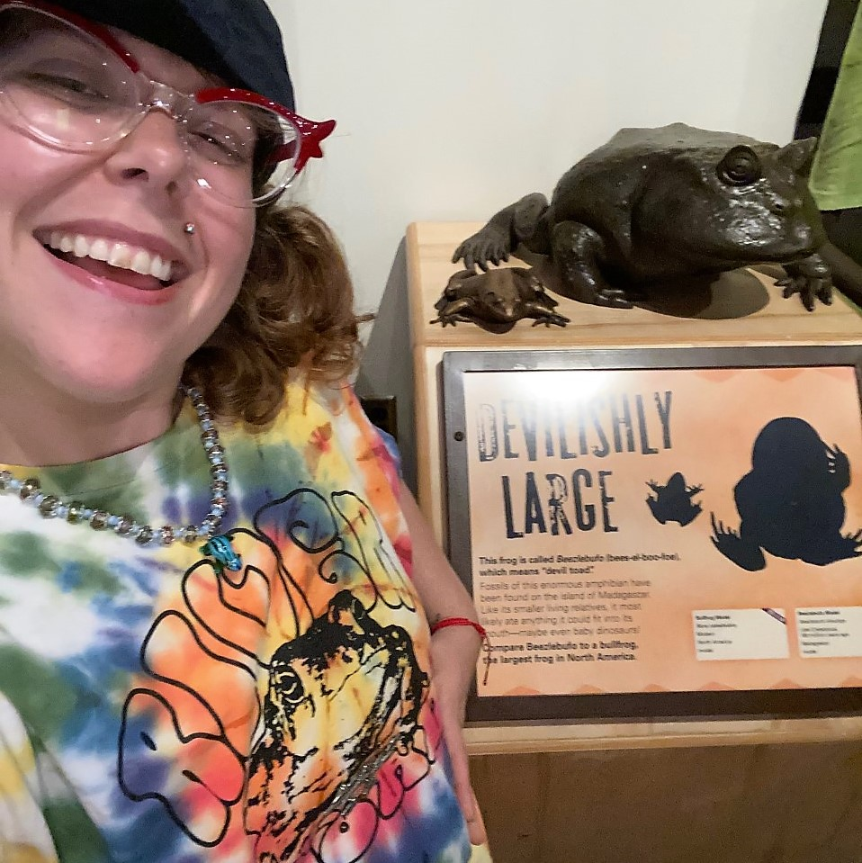

# Week 7
This week, we finished analyzing the data for our project, designing our posters, and recording our presentations!

## My Project
To finalize our posters we took some glamour shots of the equipment and our methods. I spent the early part of this week analyzing all the data we collected. We found some interesting results! One of our pilots did not blink at all, and one of our pilots had very interesting fixations that were neither on the drone or the given flight path for the drone - my poster explains it much better! 

 

 

Check out the evolution of my poster below. You can also check out my presentation at this link: https://mediahub.unl.edu/media/17489

 

## Lincoln

During the first half of the week, I spent lots of time with my friends while working on the data analysis and poster presentation. We had lots of good food and coffee. I also took some time to work independently at the Crescent Moon Coffee. They had a delicious drink called the Black Cat - 4 espresso shots and syrup was exactly what I needed to make the final push. To celebrate a successful summer, I got my first tattoo that I've wanted for a few years now. Ty Smith Tattoos did an incredible job.

 

 

Once everyone finished their presentations, we celebrated together by exploring the Natural History Musuem, taking on the Big Mouth challenge at Hurts Donuts, gaming at the VS Arcade Bar, and enjoying the atmosphere all around Lincoln downtown. Also - I got to see dogs twice this week, so that was an extra success :D

 

 

 

 

Next week, we will showcase our poster at the College of Engineering’s Summer Undergraduate Research Fair and discuss our posters at the virtual SRP symposium - and summarize the processes we followed for our mentors - then we will leave :'( Even though I will miss Lincoln so much, I will try my best to return. I have enjoyed the community, the nature, and the university. It's truly felt like home, away from home. There's no place like Nebraska! 